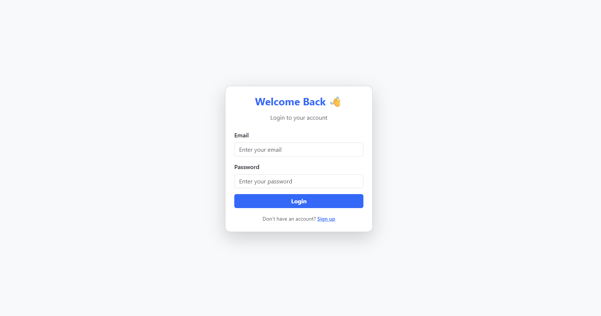
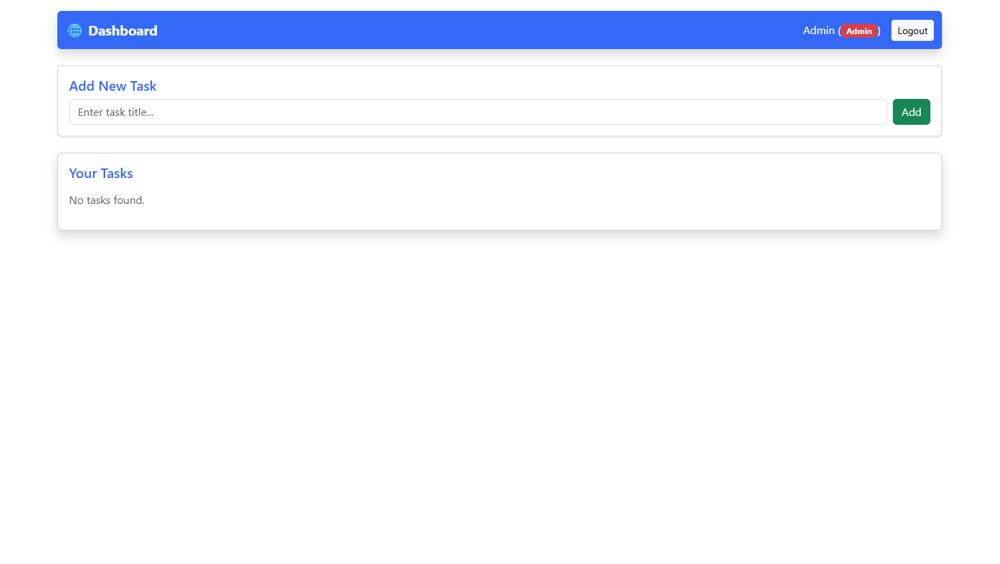
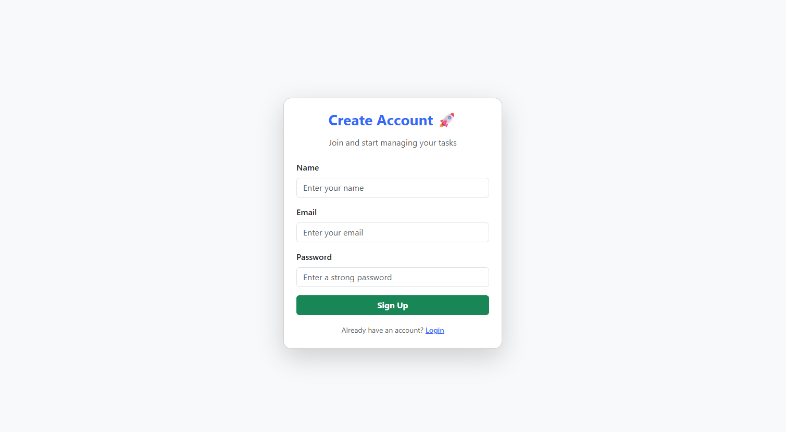

# 🚀 Scalable Web App with Authentication, Role-Based Access & Dashboard

A **full-stack scalable web application** built for **Frontend + Backend Developer Internship Assignments**.  
This project integrates both assignments into a single complete product — featuring secure authentication, role-based access, CRUD operations, and a responsive modern UI.

---

## 🧩 Tech Stack

**Frontend:**
- React.js (Create React App)
- Bootstrap 5 (for elegant, responsive UI)
- Axios (for API requests)
- React Router DOM (for routing)

**Backend:**
- Node.js & Express.js
- SQLite (via Sequelize ORM)
- JWT Authentication
- bcrypt (for password hashing)
- CORS enabled

---

## 🎯 Core Features

### 🔐 Authentication
- Register & Login using JWT
- Secure password hashing (bcrypt)
- Role-based login: **Admin** & **User**

### 🧑‍💻 Dashboard
- View user profile (name, email, role)
- Add new tasks
- Edit & Delete tasks (**admin only**)
- Search & Filter (optional extension)
- Responsive Bootstrap UI with role badges

### 🧱 Role-Based Access
```
|    Role    | Permissions                              |
|------------|------------------------------------------|
|  **User**  | View & add tasks                         |
|  **Admin** | Full CRUD (Create, Read, Update, Delete) |
```

### ⚙️ API Endpoints
```
| Method |       Endpoint        |         Description        | Auth |
|--------|-----------------------|----------------------------|------|
|  POST  | `/api/v1/auth/signup` | Register new user          |  ❌  |
|  POST  | `/api/v1/auth/login`  | Login user                 |  ❌  |
|  GET   | `/api/v1/auth/profile`| Get logged-in user details |  ✅  |
|  GET   | `/api/v1/tasks`       | Get all tasks              |  ✅  |
|  POST  | `/api/v1/tasks`       | Add new task               |  ✅  |
|  PUT   | `/api/v1/tasks/:id`   | Update task (Admin only)   |  ✅  |
| DELETE | `/api/v1/tasks/:id`   | Delete task (Admin only)   |  ✅  |
```
---

## 💻 Local Setup Instructions

### 1️⃣ Clone the repository

```bash
git clone https://github.com/RohitRaparthi/Primetrade.ai_Assignment
cd Primetrade.ai_Assignment
```
### 2️⃣ Backend Setup

```bash
cd backend
npm install
node server.js
```

✅ The backend will start on http://localhost:5000

A database.sqlite file will be auto-created on first run.

### 3️⃣ Frontend Setup

```bash
cd frontend
npm install
npm start
```

✅ The frontend will run on http://localhost:3000

---

## 🌈 Folder Structure

```
📁 scalable-webapp
 ┣ 📁 backend
 ┃ ┣ 📜 server.js
 ┃ ┣ 📜 config.js
 ┃ ┣ 📁 models/
 ┃ ┣ 📁 routes/
 ┃ ┗ 📁 controllers/
 ┣ 📁 frontend
 ┃ ┣ 📁 src/
 ┃ ┃ ┣ 📁 pages/
 ┃ ┃ ┣ 📁 api/
 ┃ ┃ ┣ 📜 App.js
 ┃ ┃ ┗ 📜 index.js
 ┗ 📜 README.md
```

---

## 🔒 Security Implementations

- JWT-based authentication middleware
- bcrypt password hashing
- Role-based route protection
- CORS policy setup
- Centralized error handling

---

## 📈 Scalability Plan

To scale this project for production:

1. Frontend
    - Build with Next.js for SSR and SEO
    - Deploy via Vercel or Netlify
    - Use environment variables for API URLs

2. Backend
    - Migrate SQLite → PostgreSQL or MongoDB
    - Use Nginx + PM2 for load balancing
    - Containerize with Docker
    - Implement caching via Redis

3. Security
    - Use HTTPS & secure cookies
    - Enable helmet & rate limiting

---

## 📬 API Testing

Use the included Postman collection (app.http or .postman_collection.json) to test:
    - Signup & Login
    - Fetch Profile
    - CRUD Operations on Tasks

---

## 🧑‍🏫 Demo Credentials
```
|    Role    | Email                 | Password   |
|------------|-----------------------|------------|
|  **Admin** | admin@primetrade.ai   | Admin@123  |
|  **User**  | test@user.com         | test@123   |
```

---

## ✨ Screenshots

### 🪪 Login Page


### 📊 Dashboard


### 🛡️ Signup Page


---

## 👨‍💻 Author

Rohit Raparthi
- 📧 Email: [rohit.raparthi2003@gmail.com](mailto:rohit.raparthi2003@gmail.com)
- 💼 GitHub: [https://github.com/RohitRaparthi](https://github.com/RohitRaparthi)
